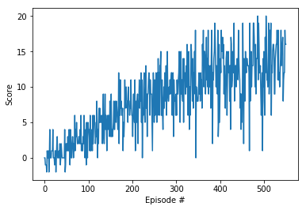

# Deep Q Network to solve the banana collecting environment

## Learning Algorithm

The algorithm used to create the agent is Deep Q Learning, which first rose to prominence when it was used to successfully play a number of Atari games ([Original DQN Paper](https://deepmind.com/research/dqn/))

The basic task of Q-Learning is to come up with an estimate of the values for each state-action pair. Deep Q Learning uses a neural network to come up with a function that approximates this table. 

Traditionally, using neural networks to estimate the Q-table has faced a problem of divergence during training. To address his issue, Deep Q Learning implements two key improvements

#### Experience Replay
Experience replay is essentially a buffer of previous states that the agent has experienced. The neural network tries to learn by randomlysampling from this buffer, rather than learning from a sequential set of states for a given episode. Sequential states in a given episode can be highly correlated, and the experience replay helps to break this correlation

#### Fixed Q Targets
This modification involves the use of a separate network whose weights are not updated as frequently as the online network.

Both of these modifications help stabilize the network during training.

### Parameters
The neural network used is a simple two-hidden layer network with ReLU activation. Each hidden layer has 64 units.

Here is the description of the network

Hidden Layer 1 - 64 units, ReLU activation
Hidden Layer 2 - 64 units, ReLU activation

Using 32 units in the hidden layers took substantially longer to solve the environment. Using 128 units took roughly the same number of episodes, and so 64 units seemed to be a good choice for the layer sizes. 

The other parameters involved were
* Gamma (Discount Factor) which was set to 0.99 which is a good default value to use
* The target network is updated every 4 time steps
* The learning rate for training the neural network is set to 0.0005
* Tau - The soft update parameter for updating the target network is set to 0.001. This parameter is used to linearly interpolate from the target networks current weights to the local networks factor. This helps the target values change smoothly over time.

## Plot of Rewards

The following plots shows the rewards per episode. The agent was able to average a reward of +13 over 100 episodes, after training for 551 episodes.

## Ideas for Future Work

There are at least two immediate avenues for future work

### Algorithm improvement
Several improvements to the original DQN paper have been proposed, implemented and found to work. The first of these is Dueling DQNs which tries to decouple the neural network into two streams - one that estimates the state value function (that is how valuable is it to be in a given state) and the advantage function.

The second is prioritized experience replay which tries to give a higher priority in the replay buffer to those (state,action,reward,next_state) tuples that result in a larger TD error.

### Architecture improvement
The architecture used in this implementation is a simple two-hidden layer network with ReLU activation. Experimenting with different architectures and activation functions could possibly yield a further improvement in the agents performance