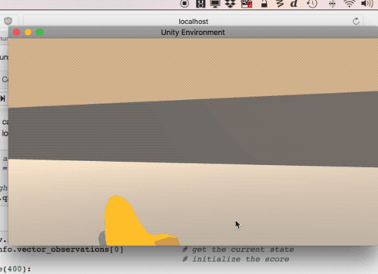

## Project Details

In this project we will attempt to train an agent to solve a yellow banana collecting environment. The environment consists of randomly located yellow and blue bananas, located atop a bounded square plane.

This environment is implemented in Unity.

##### Rewards
The agent receives a reward of +1 for collecting a yellow banana and a reward of -1 for collecting a blue blana. 

##### State
The state space consists of 37 dimensions. The state space represents the agents velocity as well as ray-based perceptions of objects in the view of the agent.. Each element of the statespace is a continuous variable.

##### Actions
The agent can take 4 actions
* Move Forward
* Move Backward
* Move Left
* Move Right

##### Solving the environment
The environment is considered solved if the agent gets an average scores of +13 over 100 consecutive episodes

## Getting Started

##### Dependencies
If you have already set up an environment for Udacity's Deep Reinforcement Learning programme, then you should have all needed dependencies installed. If not head over to 

https://github.com/udacity/deep-reinforcement-learning#dependencies

and follow the instructions there

##### Project files
Once you've set up the environment, download all the files from this repository into a single folder, and you should be good to go

## Instructions

Navigate to the folder where you've downloaded the project files and run the command

`jupyter notebook Navigation.ipynb`

Follow the instructions in the notebook. If you do run into some errors regarding the Unity environment, try restarting the kernel.

To jump straight to training the agent first run the code in section 1, and then jump to section 4.

